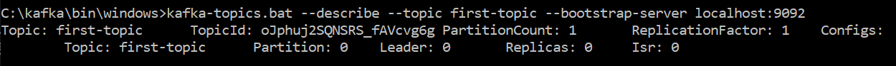

# Node.js Kafka Example

This is the example repository on working with Kafka with Node.js.

To run the example:

1. Clone this repo
1. Configure the `brokers`, `clientId` and `topic` in the `producer.js` and `consumer.js` files according to where kafka is running on your system.
1. Install dependencies by running `npm install`
1. Run `node index.js`

# Start Kafka cluster
# start zookeeper server
zookeeper-server-start.bat ..\..\config\zookeeper.properties

# start kafka server
kafka-server-start.bat ..\..\config\server.properties

# create topics
kafka-topics.bat --create --topic first-topic --bootstrap-server localhost:9092
  # output
  Created topic first-topic.
# describe the topic
kafka-topics.bat --describe --topic first-topic --bootstrap-server localhost:9092

# create event in topic 
kafka-console-producer.bat  --topic first-topic --bootstrap-server localhost:9092

# read event from topic
kafka-console-consumer.bat --topic first-topic --from-beginning --bootstrap-server localhost:9092

